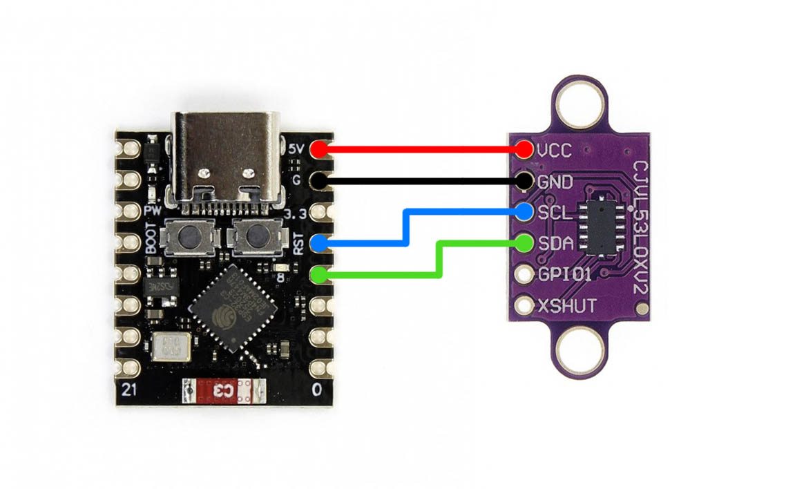

# Сенсор расстояния на датчике VL53L0X и ESPHome

Конфигурационный файл прошивки [ESPHome](https://esphome.io) микроконтроллера
ESP32-C3 SuperMini для создания совместимого
с [Home Assistant](https://www.home-assistant.io) датчика расстояния на основе
лазерного дальномера VL53L0X.

# Компоненты

Для сборки датчика потребуются: 
* Плата разработки ESP32-C3 SuperMini
* Лазерный дальномер VL53L0X
* Внешнее питание 5В (вполне подойдёт любой блок питания USB-C)

# Схема пайки

Проще некуда:



# Конфигурация

Отредактируйте файл `secrets.yaml`, указав название своей Wi-Fi точки
и пароль в параметрах `wifi_ssid` и `wifi_password`.

Это необязательно, но в файле `vl53l0x.yaml`, в секции `substitutions` можно
также поменять параметры:

* `device_name` — это название устройства. Его будет видно в списке клиентов 
на роутере, и оно же станет названием по умолчанию для сущностей датчика
в Home Assistant.
* `sensor_update_interval` — это частота обновления данных в миллисекундах.
Исходно установлено 100ms, то есть 10 раз в секунду. Минимальное значение 20ms,
максимального нет.

# Сборка и прошивка

Если вы используете версию ESPHome для командной строки, то сборка и прошивка
выполняется командой:

```bash
esphome run vl53l0x.yaml
```

Перед этим нужно подключить плату микроконтроллера к компьютеру по USB — по окончании
сборки ESPHome автоматически обнаружит подключённую плату и предложит её прошить.

После прошивки нужно отключить плату от компьютера и подключить снова (можно сразу
к блоку питания, компьютер больше не пригодится) — если вы верно указали название
точки и пароль, датчик подключится к сети и автоматически обнаружится на странице
Настройки — Устройства и службы — Интеграции в Home Assistant.
Останется только его добавить.